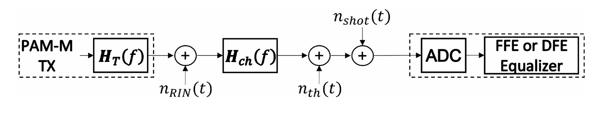

# Performance Modeling for High-Capacity IMDD Systems

This repository contains the simulation framework and analytical implementations developed as the final project of the **Digital Signal Processing (DSP) Training Program** at **Virtus-CC**, under the supervision of **Professor Edson Porto da Silva**.

The main goal of this project is to **reproduce, validate, and analyze** the results presented in the paper:

> **G. Rizzelli, P. Torres-Ferrera, F. Forghieri, and R. Gaudino**,  
> *"An Analytical Model for Performance Estimation in Modern High-Capacity IMDD Systems,"*  
> Journal of Lightwave Technology, vol. 42, no. 5, pp. 1443–1452, March 2024.

Rather than proposing a new analytical model, this work focuses on faithfully implementing the methodology described in the paper and verifying whether its theoretical predictions can be reproduced through independent simulations.

---

# Project Objectives

The project has three main objectives:

- **Analytical Reproduction**
  - Implement all analytical expressions presented in the reference paper for estimating the performance of high-capacity IMDD systems.

- **Numerical Validation**
  - Develop an independent simulation environment capable of reproducing the transmission scenario described in the paper.
  - Compare the analytical predictions with numerical simulations.

- **Result Verification**
  - Reproduce the figures and performance curves reported in the paper.
  - Evaluate the agreement between the published results and those obtained in this implementation.

---

# Simulation Framework

The simulation environment combines:

- **Custom-developed modules**, implemented specifically for this project;
- Selected functionalities from **OptiCommPy**, an open-source Python library for optical communication systems developed by Professor Edson Porto da Silva.

This hybrid approach provides full control over the implemented models while leveraging validated components for standard optical communication blocks.

---

---

# Results

The following sections compare the figures reported in the reference paper with the results obtained from this implementation.

## Example 1 – BER versus Received Optical Power

**Reference paper**

<!-- INSERT FIGURE FROM PAPER -->

<p align="center">
  
</p>

**This implementation**

<!-- INSERT GENERATED FIGURE -->

<p align="center">
  
</p>
---

## Example 2 – SNR Estimation

**Reference paper**

<!-- INSERT FIGURE FROM PAPER -->

<p align="center">
  
</p>

**This implementation**

<!-- INSERT GENERATED FIGURE -->

<p align="center">
  
</p>

---

## Example 3 – Equalizer Performance

**Reference paper**

<!-- INSERT FIGURE FROM PAPER -->

<p align="center">
  
</p>

**This implementation**

<!-- INSERT GENERATED FIGURE -->

<p align="center">
  
</p>

**This implementation**

<!-- INSERT GENERATED FIGURE -->

<p align="center">
  
</p>

---

# Repository Structure

```text

├── Functions notebooks/          # Jupyter notebooks for individual function developments
│   ├── ChannelFrequencyResponse.ipynb
│   ├── Equalizer_output.ipynb
│   ├── noisepowerdev.ipynb
│   ├── oma_calculation.ipynb
│   ├── SNR_Equalizers.ipynb
│   └── snr_tot.ipynb
├── IMDD_Simulation/              # Main simulation environment and analytical models
│   ├── images/                   # Generated simulation curves and performance figures
│   │   ├── BER x ODN Loss.png
│   │   ├── BERxB3dB.png
│   │   └── ... (and other performance plots)
│   ├── AnalyticalSNR.py          # Core Python module for analytical SNR calculations
│   ├── ChoramticDispersion.ipynb # Chromatic dispersion effects and simulation
│   ├── RIN_VAR.ipynb             # Relative Intensity Noise (RIN) variations analysis
│   └── Sim_vs_Model.ipynb        # Validation notebook comparing simulation vs. analytical model
└── README.md                     # Repository documentation
```

---

# Reference

Rizzelli, G., Torres-Ferrera, P., Forghieri, F., & Gaudino, R.

**An Analytical Model for Performance Estimation in Modern High-Capacity IMDD Systems.**

*Journal of Lightwave Technology*, Vol. 42, No. 5, pp. 1443–1452, 2024.

---
## Authors

This project was developed by:

- **Jezrael Pereira Filgueira**
- **Elmer Pimentel Farias**
- **Eduardo Henrique de Coura Freitas**
- **João Henrique Morais do Nascimento**

as part of the **Digital Signal Processing (DSP) Training Program** at **Virtus-CC**, under the supervision of **Professor Edson Porto da Silva**.
